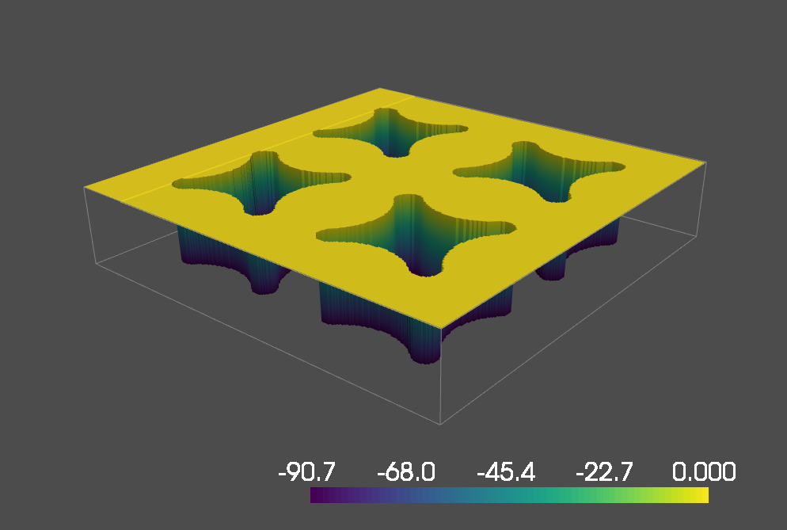

# PythonDryEtchingTool
Code was developed for SNF at Stanford University in conjunction with the E241 course. These scripts are meant to predict etch profiles from dry silicon etching based on know etch rates. Three versions are provided (version 2 is the most up-to-date):
  
* Version 2: Cellular automata implementation of dry silicon etching. Cells in a 3D grid are intialized with a state value of 1. As etching occures, the cell state is subtracted from at a user-defined rate that, for isotropic steps, is adjusted by the calculated angle between the surface normals and the center vertical axis of the etched feature. The code tracks three containers of cells: (1) dictionary of exposed cells with keys that are cell center tuples and values that define various attributes of each cells (i.e., surface normal, neighbors, state); (2) set of neighbor cells with cell center tuples of every neighbors that is defined in exposed cells; (3) set of removed cells that holds cell center tuples of cells that are etched away (state < 0). Etch conditions and simulation parameters are prescribed in USER INPUTS (clearly marked) in the main script (etch_model_version3_cellular_automata.py). All necessary methods are available in etch_sim_utilities.py. In the main script, the user should edit recipe_steps. For steps that are strictly Bosch or isotropic etching, values under 'iso' or 'bosch' should be None, respectively. The user should define etch rates functions: vert_rate, horiz_rate, and bosch_vert_step. <br/>


  * Version 1 (DOES NOT WORK WELL): More elegant implementation that evolves a surface object with easily recipe steps. This version is tailored for precribing custom bsoch, isotropic, and taperd (combined bosch and isotropic) etching steps. The surface is evolved by using the computed normals  of the surface and stepping points back along the normals by some user defined vertical and horizontal etch rates. Because this version used vtk based rendering tools, this model outputs nice interactive renders that can be saved as vtk files for later usage. Below is an example screenshot from a 90 um bosch etch (code under development). <br/>



* Version 0: Simple implementation which utilized polygon and path objects. This version grows down and out layer by layer but neglects to evolve layers constructed at previous timepoints, i.e., a Bosch step at the beginning will grow down but after this layer is formed, subsuquent etching steps will not change its shape/form. This is useful for seeing the result of horizontally moving etch fronts and how they interact with each other. <br/>


## Environment
Python 3.6 was used for developing these scripts. My personal preference is using Spyder IDE in the Anaconda environment. The solvers rely heavily on some imported python packages, so you environment should have the following installed: openCV (cv2), shapely, and pyvista. I encourage you to familiarize yourself with documentation and install instructions for each package, but in particular pyvista has a number of dependencies, most notably vtk, and some others, for full functionality, include: imageio, appdirs, and meshio.

All these packages can be directly installed from the command line (i.e., Anaconda command line) with pip. For example:
```
pip install vtk
pip install opencv-python
```

## Process Flow
Most input expected from the user is specified in the top sections of the code. Most notably the path to a etch mask is required. This is a binary .png file (example shown below). <br/>


 
Here is will describe the Version 1 code as it is meant to replace Version 0. After the mask is provided, tune the desired etch rates in the vertical and horizontal directions, the curved profile of the isotropic etch will be interpolated. Other parameters can be set, like time step (t_step) or resoltuion of mesh (set_res) that affect solution time. 

## Future of the Code
I am not a coder, so my code is messy. I would be happy for a savy coder to come along and clean up this work and maybe create more elegant classes. For SNF users, eventually I want there to be enough data that this tool can take in recipe settings (i.e. gas composition and bias voltage) and interpolate horizontal and vertical etch rates. 
